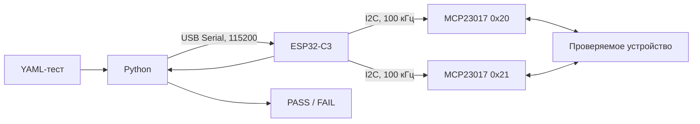
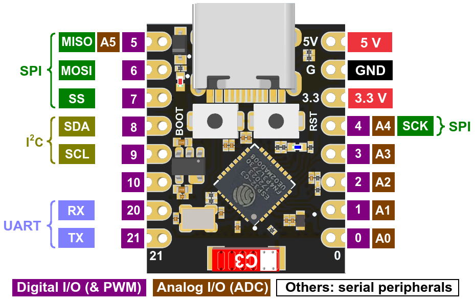

# Техническая документация FCS Test System

Документ описывает актуальную архитектуру, аппаратную нумерацию, протоколы и
форматы YAML. Пользовательская установка и обычный запуск находятся в
корневом `README.md`.

## 1. Актуальные платформы

В проекте используются две разные платформы. Их Python-программы, прошивки и
YAML-форматы нельзя смешивать.

| Платформа | Python | Прошивка | Конфигурации |
| --- | --- | --- | --- |
| Микросхемы DIP14/DIP16 | `chip_tester/chip_tester.py` | `chip_tester/esp_in_out.ino` | `chip_tester/configs` |
| Схемы на breadboard | `maket_tester/tester.py` | `maket_tester/esp_dynamic_mcp_protocol.ino` | `maket_tester/configs` |

Тестер микросхем использует фиксированные 16-канальные кадры `frame/expect`.
Макетный тестер сначала получает динамическую разметку 32 каналов, а затем —
компактные входные векторы.



В чип-тестере MCP `0x20` управляет линиями, а MCP `0x21` их считывает. В
макетном тестере направление каждой линии обоих MCP определяется динамически.

## 2. ESP32-C3 и I²C



Обе прошивки используют:

| Параметр | Значение |
| --- | --- |
| Serial | 115200 бод |
| SDA | GPIO4 |
| SCL | GPIO5 |
| I²C | 100 кГц |
| Логические уровни | 3,3 В |
| MCP | `0x20` и `0x21` |

Назначение I²C задаётся явно вызовом `Wire.begin(4, 5)`, поэтому альтернативные
подписи SDA/SCL на изображениях ESP не меняют разводку проекта.

После включения прошивка макетного тестера переводит все 32 канала в режим
входа без pull-up, то есть в безопасное высокоимпедансное состояние.

## 3. MCP23017 и порядок каналов


Прошивки обращаются к MCP23017 напрямую через `Wire` и используют регистры:

| Регистр | Адрес | Назначение |
| --- | ---: | --- |
| `IODIRA` | `0x00` | направление GPIOA |
| `IODIRB` | `0x01` | направление GPIOB |
| `GPPUA` | `0x0C` | pull-up GPIOA |
| `GPPUB` | `0x0D` | pull-up GPIOB |
| `GPIOA` | `0x12` | уровни GPIOA |
| `GPIOB` | `0x13` | уровни GPIOB |

В `IODIR` единица означает вход, а ноль — выход. Внутренние pull-up отключены.

Порядок каналов внутри одного MCP всегда следующий:

| Логический пин MCP | GPIO | Физический вывод корпуса MCP23017 |
| ---: | --- | ---: |
| 1–8 | GPA0–GPA7 | 21–28 |
| 9–16 | GPB0–GPB7 | 1–8 |

В сообщениях Python выражение `MCP 0x21 pin 3` означает третий логический канал
этого MCP, то есть GPA2 и физический вывод корпуса 23.

### 32 динамических канала макетного тестера

| Каналы платформы | MCP | Банк | Символы `pins_type` |
| --- | --- | --- | --- |
| 1–8 | `0x20` | GPIOA | 1–8 |
| 9–16 | `0x20` | GPIOB | 9–16 |
| 17–24 | `0x21` | GPIOA | 17–24 |
| 25–32 | `0x21` | GPIOB | 25–32 |

Это одновременно четыре логических 8-канальных блока, используемых
валидатором YAML.

## 4. Физическое подключение макетки

Платформа предоставляет 34 активных контакта: два контакта питания и 32
динамических сигнальных канала.

| Физический контакт | Назначение |
| ---: | --- |
| 1 | GND |
| 2 | VDD 3,3 В |
| 3–34 | динамические каналы 1–32 |

Пять 8-контактных штекеров разведены так:

| Штекер | Позиции штекера | Назначение |
| ---: | --- | --- |
| 1 | 1, 2, 3–8 | GND, VDD, каналы 1–6 |
| 2 | 1–8 | каналы 7–14 |
| 3 | 1–2 | каналы 15–16 |
| 3 | 3–8 | не подключены |
| 4 | 1–8 | каналы 17–24 |
| 5 | 1–8 | каналы 25–32 |

Таким образом, 40 мест в корпусах штекеров содержат 34 активных контакта и
шесть пустых мест третьего штекера.

Следует различать:

- физические контакты 1–34;
- динамические каналы 1–32, соответствующие символам `pins_type`;
- логические MCP-блоки 1–8, 9–16, 17–24 и 25–32;
- границы физических штекеров.

Например, каналы 1–8 находятся в конце первого и начале второго штекера, но
для YAML образуют один блок GPIOA MCP `0x20`.

Макетку нужно питать через выделенные GND и VDD. Сигнальный MCP23017 не является
источником питания: режим `v` выставляет логический HIGH на одной линии, но не
предназначен для питания шин breadboard или нагрузки. Все земли схемы и
платформы должны быть общими.

## 5. Установка DIP14 и DIP16

Слот чип-тестера имеет 16 контактов и ориентир ключа со стороны вывода 1.

### DIP16: восемь ножек с каждой стороны

DIP16 занимает слот целиком. Выводы чипа 1–16 соответствуют каналам 1–16.

### DIP14: семь ножек с каждой стороны

DIP14 вставляется по стороне ключа, а не по нижнему краю слота. Соответствие:

| DIP14 | Канал слота |
| ---: | ---: |
| 1–7 | 1–7 |
| — | 8–9 свободны |
| 8–14 | 10–16 |

Поэтому YAML с `package: DIP14_left` оставляют каналы 8 и 9 в состоянии `z` и
игнорируют их при сравнении. GND чипа, вывод 7, соответствует каналу 7; VCC,
вывод 14, соответствует каналу 16.

Чип устанавливается и извлекается только при отключённом USB-питании.

## 6. Фиксированный протокол чип-тестера

Этот протокол применяется только файлами из `chip_tester`.

### Сброс

Python перед тестом отправляет `r\n`. Прошивка очищает незавершённый кадр и
переводит управляющий MCP `0x20` в Hi-Z. Ответ на сброс не требуется.

### Кадр

Каждый тест отправляет ровно 16 символов — по одному для каналов слота 1–16:

| Символ | Действие MCP `0x20` |
| --- | --- |
| `0` | OUTPUT LOW |
| `1` | OUTPUT HIGH |
| `g` | OUTPUT LOW с обозначением смысла GND |
| `v` | OUTPUT HIGH с обозначением смысла VCC |
| `c` | импульс LOW → HIGH → LOW |
| `z` | INPUT/Hi-Z, линия не управляется |

После применения кадра прошивка считывает MCP `0x21` и возвращает 16 ASCII-бит
в порядке каналов 1–16. Строковый `expect` той же длины использует `0/1` для
проверки и `x/?/-/z` для пропуска позиции.

## 7. Динамический протокол макетного тестера

Протокол состоит из конфигурационной и измерительной фаз.

### Фаза 1: конфигурация

Перед каждым YAML Python выполняет:

1. очищает входной Serial-буфер;
2. отправляет байт `r`;
3. снова очищает накопившийся ввод;
4. отправляет 32 ASCII-символа `pins_type` без обязательного перевода строки.

После `r` прошивка переводит линии в Hi-Z и ожидает новую конфигурацию. Пробелы
и переводы строк игнорируются.

Символы конфигурации:

| Символ | Смысл относительно проверяемой макетки | Режим MCP |
| --- | --- | --- |
| `i` | вход макетки, значение приходит из `input` | OUTPUT LOW/HIGH |
| `o` | выход макетки, который нужно прочитать | INPUT/Hi-Z |
| `c` | тактовый вход макетки | OUTPUT, обычно LOW |
| `g` | фиксированный логический LOW | OUTPUT LOW |
| `v` | фиксированный логический HIGH | OUTPUT HIGH |
| `z` | отключённый/игнорируемый канал | INPUT/Hi-Z |

Название `i` относится к входу проверяемой схемы, поэтому для MCP это выход.
Название `o` относится к выходу схемы, поэтому для MCP это вход.

### Фаза 2: тестовые векторы

Для каждого YAML-теста Python отправляет только биты `input`, соответствующие
символам `i` в `pins_type`. Порядок — слева направо по конфигурации. Каналы `c`
в `input` не входят.

Прошивка:

1. обновляет все `i`;
2. ждёт стабилизации 1 мс;
3. одновременно поднимает все `c` в HIGH;
4. удерживает HIGH 2 мс;
5. возвращает все `c` в LOW и удерживает LOW 2 мс;
6. читает только банки, содержащие `o`;
7. возвращает по одному ASCII-байту на каждый `o` в порядке `pins_type`.

Если конфигурация не содержит `i`, Python отправляет служебный `0`, который
только запускает импульс и измерение. Этот байт не относится ни к одному пину.

При ошибке чтения I²C прошивка сохраняет длину ответа, но вместо значения
соответствующего выхода отправляет `E`. Python сообщает адрес MCP и банк GPIOA
или GPIOB; `E` не превращается в ложный логический ноль.

## 8. YAML чип-тестера

Минимальный пример DIP16:

```yaml
chip: example
package: DIP16
stop_on_fail: true
reset_before_run: true

tests:
  - name: first vector
    frame: "10zzzzzgzzzzzzzv"
    expect: "xx1xxxxxxxxxxxxx"
```

Поля:

| Поле | Обязательное | Назначение |
| --- | :---: | --- |
| `chip` | нет | имя в отчёте |
| `package` | нет | документальное обозначение DIP14/DIP16 |
| `stop_on_fail` | нет | остановка после первой ошибки, по умолчанию `true` |
| `reset_before_run` | нет | отправка `r` перед конфигурацией, по умолчанию `true` |
| `tests` | да | список тестовых наборов |
| `name` | нет | имя набора |
| `frame` | да | 16 команд для каналов слота |
| `expect` | да | 16 ожиданий или словарь `pin: value` |

Формат `frame/expect` не применяется к макетному тестеру.

## 9. YAML макетного тестера

Полный компактный пример:

```yaml
board: one_bit_and
stop_on_fail: true
pins_type: "iizzzzzzzzzzzzzzozzzzzzzzzzzzzzz"
input_labels: [A, B]
output_labels: [Y]

tests:
  - name: 0 AND 0
    input: "00"
    expected: "0"
  - name: 1 AND 1
    input: "11"
    expected: "1"
```

### Поля верхнего уровня

| Поле | Обязательное | Правило |
| --- | :---: | --- |
| `board` | нет | имя макетки в отчёте |
| `stop_on_fail` | нет | остановка после первой ошибки, по умолчанию `true` |
| `pins_type` | да | ровно 32 символа `i/o/c/g/v/z` |
| `input_labels` | нет | непустые подписи, по одной на каждый `i` |
| `output_labels` | нет | непустые подписи, по одной на каждый `o` |
| `tests` | да | список тестовых векторов |

`pins_type` не обязан начинаться с `g` или `v`: питание подаётся через два
выделенных физических контакта. Первый символ `pins_type` описывает
динамический канал 1, а не GND.

### Ограничение 8-канальных блоков

Блоки 1–8, 9–16, 17–24 и 25–32 не должны одновременно содержать управляющие
`i/c` и считываемые `o`. Первый `o` должен начинаться на канале 1, 9, 17 или 25.

Допускается, например:

```text
каналы 1–8   : входы
каналы 9–16  : z
каналы 17–24 : выходы
каналы 25–32 : z
```

Границы этих блоков определяются MCP-банками, а не штекерами.

### Поля тестового вектора

| Поле | Обязательное | Правило |
| --- | :---: | --- |
| `name` | нет | описание комбинации |
| `input` | да | только `0/1`, длина равна количеству `i` |
| `expected` | да | длина равна количеству `o` |

В `expected` значения `0/1` проверяются, а `x`, `?`, `-` и `z` означают
«прочитать и показать, но не сравнивать». Они нормализуются в `x`.

Порядок `input` определяется последовательностью всех `i` в `pins_type`, а
порядок `expected` — последовательностью всех `o`. Типы `z`, `g`, `v` и `c` не
занимают позиций в этих компактных строках.

Если `input_labels` или `output_labels` отсутствуют, таблица показывает номера
динамических каналов. Если они заданы, таблица показывает смысловые имена, а
подробная ошибка содержит и имя, и физический MCP-канал.

### `stop_on_fail` и CLI

Без CLI-переопределения используется YAML-поле `stop_on_fail`.

- `--stop-on-fail` принудительно останавливает тест после первой ошибки;
- `--not-stop-on-fail` принудительно выполняет все векторы;
- параметры взаимно исключаются.

## 10. Построение теста новой макетки

1. **Составьте таблицу сигналов.** Для каждого входа, выхода и clock укажите
   динамический канал 1–32. GND и VDD в эту таблицу не включаются.
2. **Соберите `pins_type`.** Заполните все 32 позиции; неиспользуемые каналы
   обозначьте `z`.
3. **Проверьте блоки.** В одном блоке 1–8, 9–16, 17–24 или 25–32 не смешивайте
   `i/c` с `o`. При необходимости перенесите все выходы в следующий блок.
4. **Добавьте подписи.** Запишите `input_labels` в порядке `i`, а
   `output_labels` в порядке `o`.
5. **Сформируйте векторы.** `input` содержит только `i`; `expected` — только
   `o`. Для неизвестного выхода временно используйте `x`.
6. **Проверьте порядок битов.** Явно зафиксируйте, идут ли данные как
   `A3…A0` или `A0…A3`; используйте тот же порядок в подписях и строках.
7. **Начните с диагностики.** Проверьте несколько простых комбинаций или
   используйте `first_8_pins_sweep.yaml`, затем запускайте полный набор.

Для полного перебора N бинарных входов нужно `2^N` тестов. Большие наборы
лучше генерировать скриптом, но итоговый YAML всё равно должен пройти загрузку
актуальным `maket_tester/tester.py`.

## 11. Готовые конфигурации макеток

| Файл | Входы | Выходы | Наборов |
| --- | --- | --- | ---: |
| `adder_4bit_with_carry.yaml` | `Cin, A3…A0, B3…B0` | `Cout, S3…S0` | 512 |
| `multiplier_4x4.yaml` | `A3…A0, B3…B0` | `P7…P0` | 256 |
| `divider_4bit.yaml` | `A3…A0, B3…B0` | `I3…I0, R3…R0` | 256 |
| `and_1bit.yaml` | `A, B` | `And` | 4 |
| `mux_1bit.yaml` | `S, A, B` | один выход | 8 |
| `first_8_pins_sweep.yaml` | каналы 1–8 | каналы 17–24 | 256 |

У делителя `I` — целое частное, `R` — остаток. Для деления на ноль текущая
схема ожидает `I=1111`, `R=A`.

Sweep использует `xxxxxxxx`, поэтому всегда имеет логический статус PASS и
служит только для отображения считанных выходов.

## 12. Python-тестер макеток

Перед открытием протокола программа валидирует все выбранные YAML. Можно
передавать несколько файлов и glob-шаблоны.

Без `--show-passes` в интерактивном терминале отображается обновляемая на месте
таблица последнего PASS. С `--show-passes` таблицы печатаются последовательно.
`--raw` показывает байты PC → ESP и ESP → PC и отключает живую панель.

Цвет включается только для TTY и отключается при перенаправлении вывода, при
наличии переменной `NO_COLOR` или с `--no-color`. Для Windows рекомендуется
Windows Terminal; старые консоли могут хуже обрабатывать ANSI-перемещение
курсора и Unicode-рамки.

Коммуникационная ошибка печатается отдельно без таблицы выходов, поскольку
достоверных значений пинов в этом случае нет. Любой FAIL даёт ненулевой exit
code.

## 13. Изменение разводки или протокола

### Перенос сигнала

Измените соответствующий символ `pins_type`, затем переставьте значение и
подпись в компактном порядке `input` или `expected`. Проверьте, что новое
размещение не смешивает направление внутри MCP-банка.

### Изменение I²C-адреса

1. Измените аппаратные состояния A0–A2 MCP23017.
2. Проверьте отсутствие конфликта адресов.
3. Обновите `MCP_ADDRS` в прошивке.
4. Обновите преобразование адресов в Python и unit-тесты.
5. Загрузите прошивку и выполните запуск с `--raw`.

### Изменение динамического протокола

Синхронно обновите:

- допустимые символы и валидатор Python;
- приём конфигурации и векторов в прошивке;
- длину и порядок ответа;
- YAML-контракт;
- `dev/test_dynamic_mcp_tester.py`;
- эту документацию.

## 14. Проверка после изменений

Unit-тесты макетного тестера не открывают настоящий Serial-порт:

```bash
python dev/test_dynamic_mcp_tester.py
```

Минимальная проверка разработки:

```bash
python -m py_compile chip_tester/chip_tester.py maket_tester/tester.py \
  dev/test_dynamic_mcp_tester.py
python dev/test_dynamic_mcp_tester.py
git diff --check
```

После программных тестов:

1. загрузите соответствующую прошивку;
2. запустите короткий набор с `--raw`;
3. измерьте фактические уровни входов;
4. сравните выходы схемы с ответом MCP;
5. намеренно измените одно ожидание и убедитесь, что FAIL указывает нужный
   канал;
6. запустите полный тест заведомо исправного устройства.

## 15. Карта файлов

```text
fcs-test-system/
├── README.md
├── requirements.txt
├── chip_tester/
│   ├── chip_tester.py                  фиксированный тестер DIP14/DIP16
│   ├── esp_in_out.ino                  прошивка чип-тестера
│   └── configs/                        frame/expect YAML чипов
├── maket_tester/
│   ├── tester.py                       динамический YAML-тестер макеток
│   ├── esp_dynamic_mcp_protocol.ino    динамическая прошивка
│   └── configs/                        pins_type/input/expected YAML
├── dev/
│   ├── test_dynamic_mcp_tester.py      unit-тесты без оборудования
│   ├── documentation/                  техническая документация и изображения
│   └── test_system_node/               ранний прототип
└── archive/                             неиспользуемые старые реализации
```

Материалы из `archive` и `dev/test_system_node` не входят в актуальный тракт
запуска и не совместимы с динамическим YAML макетного тестера.
