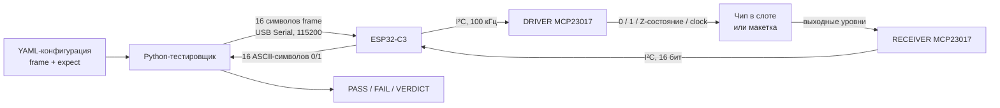
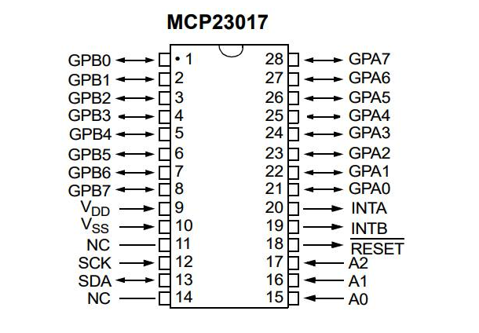

# Техническая документация FCS Test System

Этот документ описывает внутреннее устройство тестирующей системы: аппаратные компоненты, обмен данными, формат тестов и типовые изменения. Инструкция по установке и обычному запуску находится в корневом `README.md`.

## 1. Назначение и состав системы

Система автоматически подаёт наборы цифровых сигналов на проверяемое устройство, считывает его ответы и сравнивает их с ожидаемыми значениями из YAML-файла.

Существуют две физические платформы:

| Платформа | Проверяемое устройство | Подключение устройства |
| --- | --- | --- |
| Тестер микросхем | DIP14 и DIP16 серии 74HC | Микросхема устанавливается в слот |
| Тестер макеток | Собранная цифровая схема | `DRIVER` подключаются ко входам, `RECEIVER` — к выходам |

В каждой платформе используются:

- компьютер с Python-программой;
- ESP32-C3 Super Mini;
- управляющий MCP23017 — далее `DRIVER MCP`;
- считывающий MCP23017 — далее `RECEIVER MCP`;
- проверяемый чип или макетка;
- YAML-файл с тестовыми наборами.

### Общая схема взаимодействия



Python не управляет MCP23017 напрямую. Он передаёт ESP32 компактный 16-символьный кадр. ESP32 преобразует его в настройки портов MCP23017, считывает ответ и возвращает компьютеру 16 символов `0`/`1`.

### Различия двух платформ

| Назначение | Python | Прошивка ESP32 | DRIVER MCP | RECEIVER MCP |
| --- | --- | --- | --- | --- |
| Микросхемы | `new_chip_tester/chip_tester.py` | `esp_in_out/esp_in_out.ino` | `0x20` | `0x21` |
| Макетки | `maket_tester/maket_tester.py` | `esp_maket_in_out/esp_maket_in_out.ino` | `0x20` | `0x24` |

Python-скрипт и прошивку следует использовать парой из одной строки таблицы.

## 2. ESP32-C3 Super Mini


ESP32 выполняет роль моста между USB-портом компьютера и двумя MCP23017. Она принимает команды Python по последовательному соединению, управляет расширителями по I²C и отправляет измеренные уровни обратно.

### Используемые элементы и выводы

| Элемент или вывод | Назначение на плате | Использование в системе |
| --- | --- | --- |
| USB-C | Питание и USB-соединение | Питает ESP32 и MCP23017, создаёт последовательный порт для Python |
| `3.3 V` | Стабилизированное питание 3,3 В | Питание обоих MCP23017 |
| `GND` / `G` | Земля питания | Общая земля ESP32 и компонентов проверочной платформы |
| GPIO4 | Универсальный цифровой вывод | SDA шины I²C в обеих актуальных прошивках |
| GPIO5 | Универсальный цифровой вывод | SCL шины I²C в обеих актуальных прошивках |
| `BOOT` | Загрузочный режим ESP32 | Используется при загрузке прошивки, если плата не входит в режим прошивки автоматически |
| `RST` | Сброс ESP32 | Перезапускает текущую прошивку |

На изображении около GPIO указаны распространённые альтернативные функции, например SPI, ADC и стандартные варианты I²C. Эти подписи не закрепляют функцию вывода навсегда. В проекте вызов

```cpp
Wire.begin(SDA_PIN, SCL_PIN);
```

явно назначает SDA на GPIO4, а SCL на GPIO5, хотя на картинке около обозначения I²C показаны GPIO8 и GPIO9.

GPIO0–3, GPIO6–10, GPIO20 и GPIO21 текущими прошивками тестирующей системы не используются. Последовательный обмен выполняется через USB и объект `Serial`.

### Инициализация ESP32

Обе актуальные прошивки выполняют одинаковую базовую настройку:

```text
Serial: 115200 бод
SDA: GPIO4
SCL: GPIO5
I²C: 100000 Гц
Количество тестовых каналов: 16
```

После запуска ESP32 ждёт около 1,5 секунды, инициализирует I²C и переводит все каналы управляющего MCP23017 в Z-состояние.

## 3. MCP23017



MCP23017 расширяет шину I²C шестнадцатью цифровыми линиями. В каждой платформе один MCP выставляет сигналы, второй постоянно работает как вход и считывает результат.

### Назначение выводов

| Физические выводы | Название | Назначение | Использование в системе |
| --- | --- | --- | --- |
| 21–28 | `GPA0–GPA7` | 8 цифровых линий порта A | Логические каналы 1–8 |
| 1–8 | `GPB0–GPB7` | 8 цифровых линий порта B | Логические каналы 9–16 |
| 9 | `VDD` | Положительное питание | 3,3 В от ESP32 |
| 10 | `VSS` | Земля питания | GND проверочной платформы |
| 12 | `SCK` / `SCL` | Тактовая линия I²C | Соединена с GPIO5 ESP32 |
| 13 | `SDA` | Линия данных I²C | Соединена с GPIO4 ESP32 |
| 15–17 | `A0–A2` | Аппаратный выбор I²C-адреса | Задаёт адрес конкретного MCP23017 |
| 18 | `RESET` | Аппаратный сброс, активный LOW | В обычной работе должен находиться в неактивном HIGH |
| 19–20 | `INTB`, `INTA` | Выходы прерываний портов B/A | Текущими прошивками не используются |
| 11, 14 | `NC` | Не подключены внутри микросхемы | Не используются |

`SCK` на изображении MCP23017 в режиме I²C является линией `SCL`. Оба названия относятся к физическому выводу 12.

### Адреса MCP23017

Базовый адрес MCP23017 равен `0x20`. Состояния `A2`, `A1`, `A0` добавляют к нему три младших адресных бита:

| Адрес | A2 | A1 | A0 | Применение |
| --- | ---: | ---: | ---: | --- |
| `0x20` | 0 | 0 | 0 | DRIVER на обеих платформах |
| `0x21` | 0 | 0 | 1 | RECEIVER платформы для чипов |
| `0x24` | 1 | 0 | 0 | RECEIVER платформы для макеток |

Оба MCP находятся на одной I²C-шине, поэтому их адреса должны различаться. Значения в аппаратной адресации должны совпадать с константами прошивки:

```cpp
// Платформа для чипов
const byte MCP_IO = 0x20;
const byte MCP_READER = 0x21;

// Платформа для макеток
const byte MCP_DRIVER = 0x20;
const byte MCP_READER = 0x24;
```

### Регистры, используемые прошивкой

Прошивки работают с MCP23017 напрямую через `Wire`, без внешней библиотеки:

| Регистр | Адрес | Назначение |
| --- | --- | --- |
| `IODIRA` | `0x00` | Направление линий GPA0–GPA7 |
| `IODIRB` | `0x01` | Направление линий GPB0–GPB7 |
| `GPPUA` | `0x0C` | Внутренние pull-up порта A |
| `GPPUB` | `0x0D` | Внутренние pull-up порта B |
| `GPIOA` | `0x12` | Запись/чтение уровней порта A |
| `GPIOB` | `0x13` | Запись/чтение уровней порта B |

В `IODIR` значение бита `1` означает вход/Z-состояние, а `0` — выход. Внутренние pull-up на обеих микросхемах отключены.

## 4. Нумерация каналов и физическое подключение

Во всём тракте используется один порядок: первый символ строки соответствует каналу 1, шестнадцатый — каналу 16.

| Канал | Порт MCP23017 | Физический вывод MCP23017 | Позиция `frame` | Позиция `expect` |
| ---: | --- | ---: | ---: | ---: |
| 1 | GPA0 | 21 | 1 | 1 |
| 2 | GPA1 | 22 | 2 | 2 |
| 3 | GPA2 | 23 | 3 | 3 |
| 4 | GPA3 | 24 | 4 | 4 |
| 5 | GPA4 | 25 | 5 | 5 |
| 6 | GPA5 | 26 | 6 | 6 |
| 7 | GPA6 | 27 | 7 | 7 |
| 8 | GPA7 | 28 | 8 | 8 |
| 9 | GPB0 | 1 | 9 | 9 |
| 10 | GPB1 | 2 | 10 | 10 |
| 11 | GPB2 | 3 | 11 | 11 |
| 12 | GPB3 | 4 | 12 | 12 |
| 13 | GPB4 | 5 | 13 | 13 |
| 14 | GPB5 | 6 | 14 | 14 |
| 15 | GPB6 | 7 | 15 | 15 |
| 16 | GPB7 | 8 | 16 | 16 |

### Платформа для макеток

Номера двух наборов проводов независимы по назначению, но используют одинаковый программный порядок:

- `DRIVER N` получает команду из символа N поля `frame`;
- `RECEIVER N` формирует символ N ответа ESP и сравнивается с символом N поля `expect`.

Например:

```yaml
frame:  "10zzzzzzzzzzzzzz"
expect: "xxx1xxxxxxxxxxxx"
```

означает:

- `DRIVER 1` подаёт `1`;
- `DRIVER 2` подаёт `0`;
- `DRIVER 3–16` находятся в Z-состоянии;
- проверяется только `RECEIVER 4`, на нём ожидается `1`.

Макетка получает 3,3 В от отдельного модуля питания для breadboard-плат. ESP32 и MCP23017 получают 3,3 В со стороны проверочной платформы.

### Платформа для микросхем

Управляющий и считывающий каналы одного номера подключены к соответствующей линии слота. Для DIP16 номера каналов 1–16 соответствуют выводам микросхемы 1–16.

Для DIP14 используются две группы с промежутком:

| Вывод DIP14 | Канал платформы |
| ---: | ---: |
| 1–7 | 1–7 |
| — | 8–9 не используются |
| 8–14 | 10–16 |

Поэтому в конфигурациях с `package: DIP14_left` земля чипа находится на канале 7, а VCC — на канале 16. Например, кадр для 74HC04 содержит `g` в позиции 7 и `v` в позиции 16.

Питание чипа задаётся каждым тестовым кадром:

- `g` на линии GND создаёт активный LOW;
- `v` на линии VCC создаёт активный HIGH 3,3 В.

## 5. Протокол Python ↔ ESP32

Протокол текстовый и не содержит заголовка или контрольной суммы.

### Сброс состояния

Команда `r` сбрасывает незавершённый кадр и переводит все DRIVER-линии в Z-состояние. ESP не отправляет ответ на `r`. Переводы строк и пробелы прошивкой игнорируются, поэтому `r` и `r\n` обрабатываются одинаково.

### Тестовый кадр

Python отправляет ровно 16 ASCII-символов без обязательного перевода строки:

```text
0z1z0zgzzz0z0z0v
```

Допустимые команды:

| Символ | Состояние DRIVER | Реализация в ESP |
| --- | --- | --- |
| `z` | Z-состояние | MCP-линия остаётся входом, pull-up выключен |
| `0` | Логический LOW | MCP-линия становится выходом со значением 0 |
| `1` | Логический HIGH | MCP-линия становится выходом со значением 1 |
| `g` | GND-подобная линия | Активный выход LOW, электрически совпадает с `0` |
| `v` | VDD-подобная линия | Активный выход HIGH, электрически совпадает с `1` |
| `c` | Тактовый импульс | LOW → HIGH → LOW |

Кадр начинает выполняться только после приёма всех 16 допустимых символов.

### Ответ

После применения кадра ESP считывает RECEIVER MCP и возвращает ровно 16 ASCII-символов:

```text
0101011010100101
```

Первый символ — GPA0/канал 1, восьмой — GPA7/канал 8, девятый — GPB0/канал 9, последний — GPB7/канал 16. Перевод строки после ответа не отправляется.

## 6. Что делает прошивка ESP32

### Запуск и сброс

1. Запускается `Serial` на скорости 115200.
2. Запускается I²C на GPIO4/GPIO5 со скоростью 100 кГц.
3. Все 16 линий DRIVER переводятся во входы/Z-состояние.
4. Внутренние pull-up DRIVER отключаются.
5. Все 16 линий RECEIVER настраиваются как входы без pull-up.

Команда `r` повторяет безопасную настройку DRIVER и очищает позицию приёма кадра.

### Обработка кадра

Для 16 символов прошивка строит три 16-битные маски:

- `outputMask` — какие линии должны стать выходами;
- `outputValue` — какие выходы должны иметь HIGH;
- `clockMask` — на каких линиях нужен тактовый импульс.

Затем выполняется последовательность:

1. Значения заранее записываются в выходной регистр MCP.
2. Через `IODIR` выбранные линии переключаются из Z-состояния в выходы.
3. Выдерживается 2 мкс для установления уровней.
4. Для линий `c` формируется HIGH, затем возврат в LOW. Текущее время HIGH и LOW — по 2 мс.
5. Выдерживается ещё 2 мкс.
6. ESP считывает `GPIOA` и `GPIOB` RECEIVER MCP.
7. Полученное 16-битное значение печатается в порядке каналов 1–16.
8. Позиция приёма очищается для следующего кадра.

Функции `writeGPIO16`, `readGPIO16`, `writeIODIR16` и `writeGPPU16` объединяют два 8-битных регистра MCP в одно 16-битное значение.

## 7. Что делает Python-тестировщик

Оба Python-скрипта реализуют одинаковую логическую последовательность:

1. Разворачивают пути и glob-шаблоны YAML-файлов.
2. Загружают YAML через `yaml.safe_load`.
3. Проверяют наличие списка `tests`.
4. Открывают указанный последовательный порт.
5. Ждут перезапуска ESP после открытия порта и очищают входной буфер.
6. Перед конфигурацией при необходимости отправляют `r`.
7. Проверяют длину и символы `frame`.
8. Нормализуют `expect` в 16-символьную строку.
9. Отправляют `frame` и получают 16 считанных битов.
10. Сравнивают только позиции, где ожидается `0` или `1`.
11. Печатают `PASS` либо `FAIL` с номерами несовпавших каналов.
12. Формируют сводку и итоговый вердикт.

Параметры запуска:

| Параметр | Значение |
| --- | --- |
| `configs` | Один или несколько YAML-файлов либо glob-шаблонов |
| `--port` | Последовательный порт ESP32 |
| `--baud` | Скорость Serial, штатно 115200 |
| `--timeout` | Ожидание ответа платформы |
| `--show-passes` | Показать каждый успешный тест |
| `--raw` | Показать необработанный обмен с ESP |

## 8. Формат YAML

### Полный пример

```yaml
board: example_board
package: custom
notes:
  - Example configuration
stop_on_fail: true
reset_before_run: true

tests:
  - name: input 10 produces output 1
    frame: "10zzzzzzzzzzzzzz"
    expect: "xxx1xxxxxxxxxxxx"

  - name: check selected outputs
    frame: "01zzzzzzzzzzzzzz"
    expect:
      p4: 0
      p7: 1
```

### Поля верхнего уровня

| Поле | Обязательное | Назначение |
| --- | --- | --- |
| `tests` | Да | Список тестовых наборов |
| `chip` | Для удобства чип-тестера | Название микросхемы в выводе |
| `board` | Для удобства тестера макеток | Название макетки в выводе |
| `name` | Нет | Резервное название макетки, если нет `board` |
| `package` | Нет | Описание корпуса; хранится как метаданные |
| `notes` | Нет | Комментарии для сопровождающего |
| `stop_on_fail` | Нет | `true` — остановиться после первой ошибки; по умолчанию `true` |
| `reset_before_run` | Нет | `true` — отправить `r` перед конфигурацией; по умолчанию `true` |

### Поля тестового набора

| Поле | Обязательное | Назначение |
| --- | --- | --- |
| `name` | Нет | Человекочитаемое название; иначе используется номер теста |
| `frame` | Да | Ровно 16 команд для DRIVER |
| `expect` | Да | Ожидания для 16 RECEIVER |

Строковый `expect` принимает `0`, `1`, `x`, `?`, `-` и `z`. Символы `?`, `-` и `z` нормализуются в `x`, то есть соответствующий канал не проверяется.

Альтернативный словарный формат задаёт только значимые каналы:

```yaml
expect:
  4: 0
  p7: 1
```

Числовые ключи и ключи вида `pN` равнозначны. Неуказанные позиции автоматически становятся `x`.

### Порядок тестов

Тесты выполняются сверху вниз. Для комбинационных схем каждый набор обычно независим. Для последовательностных устройств порядок имеет значение: например, тест 74HC161 сначала сбрасывает или загружает счётчик, а следующие кадры с `c` последовательно изменяют состояние.

## 9. Добавление теста нового чипа

1. Найдите datasheet и определите корпус, VCC, GND, входы, выходы и управляющие сигналы.
2. Перенесите физические выводы в каналы платформы:
   - DIP16: вывод N → канал N;
   - DIP14: выводы 1–7 → каналы 1–7, выводы 8–14 → каналы 10–16.
3. Создайте новый YAML в `new_chip_tester/configs`.
4. В каждом `frame` поставьте:
   - `v` на VCC;
   - `g` на GND;
   - `0`/`1` на обычные входы;
   - `z` на выходы;
   - `c` на clock, если нужен импульс.
5. В `expect` поставьте `0`/`1` на проверяемые выходы и `x` на остальные позиции.
6. Для комбинационной логики переберите все значимые комбинации входов.
7. Для последовательностной логики сначала добавьте известное начальное состояние — reset или load — затем последовательность переходов.
8. Запустите один тест с `--show-passes --raw`, проверьте нумерацию, затем выполните весь набор.

Минимальный шаблон DIP16:

```yaml
chip: NEW CHIP
package: DIP16
stop_on_fail: true
reset_before_run: true
tests:
  - name: first vector
    frame: "zzzzzzzgzzzzzzzv"
    expect: "xxxxxxxxxxxxxxxx"
```

## 10. Добавление теста новой макетки

1. Составьте таблицу входов макетки и назначьте каждому входу номер `DRIVER`.
2. Составьте таблицу выходов и назначьте каждому выходу номер `RECEIVER`.
3. Зафиксируйте порядок битов, особенно младший и старший биты шин.
4. Создайте YAML в `maket_tester/configs`.
5. Для каждого входного набора сформируйте 16-символьный `frame`; неиспользуемые DRIVER обозначьте `z`.
6. Рассчитайте правильные выходы и внесите их в те же позиции `expect`, что и номера RECEIVER.
7. Неподключённые и незначимые RECEIVER обозначьте `x`.
8. Сначала проверьте крайние случаи, затем добавьте полный перебор или репрезентативный набор.

Пример таблицы подключения перед созданием YAML:

| Сигнал схемы | Провод | Позиция YAML |
| --- | --- | ---: |
| `A0` | DRIVER 1 | `frame[1]` |
| `A1` | DRIVER 2 | `frame[2]` |
| `Y0` | RECEIVER 1 | `expect[1]` |
| `Y1` | RECEIVER 2 | `expect[2]` |

Индексы в этой таблице записаны в человеческой нумерации 1–16, а не как Python-индексы 0–15.

## 11. Генерация больших наборов

Когда комбинаций много, YAML удобнее генерировать программой. Пример находится в `new_chip_tester/configs/mux_test_gen.py`:

1. Создаётся словарь с метаданными и пустым `tests`.
2. `itertools.product` перебирает комбинации входов.
3. Для комбинации строятся `frame` и `expect` длиной 16.
4. Тест добавляется в список.
5. Результат сохраняется через `yaml.dump`.

После генерации следует проверить:

- длину каждого `frame` и строкового `expect`;
- допустимые символы;
- позиции VCC/GND;
- несколько вручную рассчитанных комбинаций;
- первый и последний тест;
- количество тестов относительно ожидаемого пространства входов.

Генератор является исходником теста: если логика или разводка изменились, сначала исправляется генератор, затем YAML создаётся заново.

## 12. Изменение подключения

### Сигнал перенесён на другой DRIVER

Если вход схемы перенесён с `DRIVER N` на `DRIVER M`, его символ необходимо перенести с позиции N на позицию M во всех `frame`. Старую позицию обычно заменяют на `z`.

### Сигнал перенесён на другой RECEIVER

Если выход перенесён с `RECEIVER N` на `RECEIVER M`, ожидаемый `0`/`1` переносится с позиции N на позицию M во всех `expect`. Старую позицию заменяют на `x`.

### Изменился физический порядок проводов

Программный контракт предполагает порядок GPA0–GPA7, затем GPB0–GPB7. После физической перестановки есть два подхода:

1. Сохранить программный порядок и заново промаркировать провода по фактическим MCP-каналам.
2. Сохранить старые подписи проводов и добавить перестановку битов в прошивке при разборе `frame` и формировании ответа.

Первый вариант не требует изменения существующих YAML. Во втором нужно одинаково проверить направление PC → DRIVER и RECEIVER → PC.

### Изменился I²C-адрес

1. Задайте новый адрес аппаратными состояниями A0–A2.
2. Убедитесь, что он не совпадает с адресом второго MCP на этой шине.
3. Измените `MCP_IO`, `MCP_DRIVER` или `MCP_READER` в нужной `.ino`.
4. Загрузите обновлённую прошивку.
5. Выполните короткий тест с `--raw`.

### Изменился протокол

Формат кадра и ответа реализован одновременно в Python и ESP. При добавлении новой команды, изменении длины или порядка каналов синхронно обновляются:

- набор допустимых символов в Python;
- проверка длины `frame` и `expect`;
- `isCommandByte` и `processFrame` в обеих актуальных прошивках;
- формирование ответа `printBitsPinOrder`;
- чтение ответа Python;
- YAML-конфигурации и эта документация.

## 13. Проверка после изменений

Минимальная последовательность проверки:

1. Проверить синтаксис Python:

   ```bash
   python -m py_compile new_chip_tester/chip_tester.py maket_tester/maket_tester.py
   ```

2. Проверить загрузку YAML и длину кадров.
3. Загрузить прошивку в соответствующую ESP32.
4. Запустить один простой набор с `--raw --show-passes`.
5. Сопоставить отправленный кадр с фактическими уровнями DRIVER.
6. Сопоставить физические выходы с ответом RECEIVER.
7. Запустить полный тест известного исправного устройства.
8. Убедиться, что намеренно неверное ожидание приводит к `FAIL` на нужном канале.

Для автоматической проверки YAML можно использовать:

```python
from pathlib import Path

import yaml

allowed_frame = set("z01vgc")
allowed_expect = set("01xX?-zZ")

for path in Path("new_chip_tester/configs").glob("*.yaml"):
    data = yaml.safe_load(path.read_text(encoding="utf-8"))
    assert isinstance(data.get("tests"), list), path

    for test in data["tests"]:
        frame = str(test["frame"]).strip()
        assert len(frame) == 16, (path, test.get("name"), frame)
        assert set(frame.lower()) <= allowed_frame, (path, frame)

        expect = test["expect"]
        if isinstance(expect, str):
            assert len(expect.strip()) == 16, (path, expect)
            assert set(expect) <= allowed_expect, (path, expect)
```

## 14. Старый вариант прошивки

`test_system_node/test_system_node.ino` относится к раннему варианту системы. Он использует библиотеку `Adafruit_MCP23X17`, принимает бинарный четырёхбайтовый кадр и возвращает два бинарных байта.

Текущие `chip_tester.py` и `maket_tester.py` работают с 16-символьным текстовым протоколом, поэтому `test_system_node.ino` с ними несовместим и в рабочем тракте двух актуальных платформ не используется.

## 15. Карта файлов

```text
fcs-test-system/
├── README.md                              запуск для пользователя
├── requirements.txt                       pyserial и PyYAML
├── documentation/
│   ├── documentation.md                   этот документ
│   ├── esp32c3_super_mini_pinout.png       распиновка ESP32-C3
│   └── mcp23017_pinout.png                 распиновка MCP23017
├── new_chip_tester/
│   ├── chip_tester.py                     Python-тестер микросхем
│   └── configs/                            тесты микросхем
├── maket_tester/
│   ├── maket_tester.py                    Python-тестер макеток
│   └── configs/                            тесты макеток
├── esp_in_out/esp_in_out.ino               актуальная прошивка платформы чипов
├── esp_maket_in_out/esp_maket_in_out.ino   актуальная прошивка платформы макеток
└── test_system_node/test_system_node.ino   старый бинарный протокол
```
